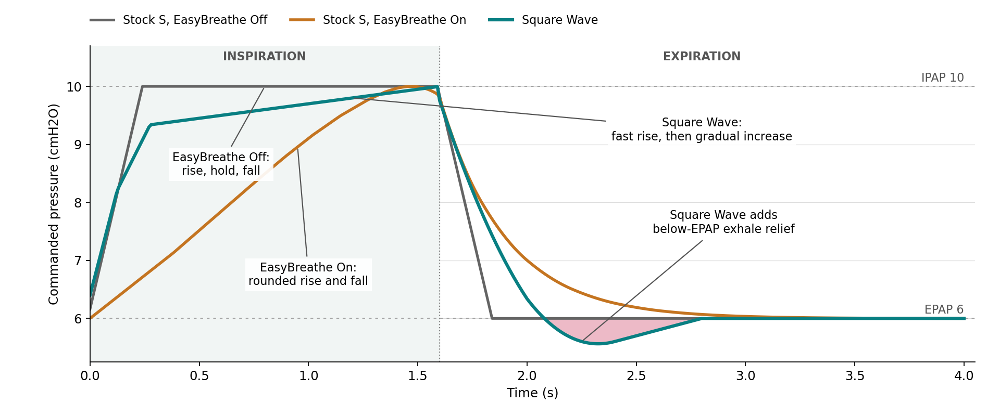

# Square Wave

The Square Wave payload replaces the stock pressure-shaping handler used by S,
ST, T, and PAC. It does not affect CPAP, AutoSet, VAuto, ASV, ASVAuto, or iVAPS.

<p align="center">
  
</p>

## Control

| Setting | UART | Range | Default | Menu | Visible modes | Function | Without `custom_settings` |
|---------|------|-------|---------|------|---------------|----------|---------------------------|
| Square Wave | `RPF` | Off, On | On | Therapy | S, ST, T, PAC | On selects custom pressure shaping; Off calls the stock handler | On |

Firmware variable assignment and persistence are listed in the
[custom settings registry](../../custom_settings.md#assignments).

## Pressure Shape

During inspiration, commanded pressure support starts near 10% of the configured
support and rises toward the full value using Rise Time and breath progress.
Pre-cycle detection can begin reducing support before expiration is formally
detected.

During expiration, the final inspiratory support fades while exhale relief can
lower the pressure target below EPAP. Relief diminishes as the remaining tracked
breath volume falls or expiration time increases. If expiration continues for
1.2 seconds, the target returns to EPAP. It remains capped at the configured
IPAP throughout the breath.

The S EasyBreathe runtime path does not use the Square Wave handler.

<details>
<summary>Pressure shaping through a breath</summary>



Stock S without EasyBreathe ramps to IPAP, holds it, then ramps back to EPAP.
EasyBreathe shapes the rise across inspiration and uses an exponential descent
toward EPAP during expiration.
Square Wave also uses breath progress during the rise and adds a curved descent
with exhale relief. The example uses the same pressure settings and prescribed
breath phases for all three, with no pre-cycle reduction. It compares pressure
shaping, not trigger or cycle timing.

The illustration uses EPAP 6 / IPAP 10 cmH2O, a 1.6-second inspiration,
10 ms updates, and linear breath progress and volume decline. The stock ramps
and Square Wave receive rise/fall counts of 25; EasyBreathe uses its stock
profile with a decay coefficient of 8.

The equations describe commanded pressure, not measured mask pressure. Support
is relative to EPAP, so negative support means a target below EPAP. Pressures
are in cmH2O and times are in seconds. `clip(x)` limits a value to 0..1.

### Inspiration

Let `PS_set = IPAP - EPAP`, `T_rise` be Rise Time, and `t_in` be elapsed
inspiration time. The final 75 ms of the rise-time ramp is spread over 150 ms
at half speed:

```text
t_shaped = min(t_in, T_rise - 0.075)
         + min(max((t_in - (T_rise - 0.075)) / 2, 0), 0.075)
R = clip(t_shaped / T_rise)
```

Support combines a 10% starting level, a 70% rise-time contribution, and up to
20% from firmware breath progress. Here `B` is inspiratory progress normalized
to 0..1:

```text
PS_in = PS_set * clip(0.10 + 0.70 * R + 0.20 * B - D)
```

Rise Time therefore does not determine the entire pressure rise: the final
contribution follows breath progress.

### Pre-cycle

`D` reduces support while inspiration is still active. Each qualifying low-flow
sample adds to a counter; each nonqualifying sample reduces it toward zero.
The counter resets when the breath changes phase.

```text
D = counter * 0.01 / 1.5
```

Each counted 10 ms step subtracts about 0.67 percentage points of configured
support. This shapes pressure before cycling; it does not itself declare the
start of expiration. Custom T/C also uses this counter in its cycling decision.

### Expiration

`PS_end` is commanded support at the transition from inspiration to expiration.
Pre-cycle reduction can make it lower than the configured support. Let `t` be
elapsed expiration time:

```text
A(t) = 0.95 * clip(1 - t / 0.8)^2
PS_out(t) = A(t) * PS_end - (1 - A(t)) * E(t) * 0.8
```

The first term carries over support from inspiration and fades to zero at
0.8 seconds. The second supplies exhale relief, overlapping that descent rather
than waiting for it to finish. Its factor `E` is limited by both time and volume:

```text
E_time(t) = clip((1.2 - t) / 0.8)
E_volume = clip((V / V_peak - 0.1) / 0.6)
E(t) = min(E_time(t), E_volume)
```

`V` is tracked breath volume: it accumulates with positive compensated flow
and decreases with negative flow, without falling below zero. `V_peak` is its
maximum since inspiration began. If `V_peak` is zero, only `E_time` is used.

Time allows full relief through 0.4 seconds, then reduces it to zero at
1.2 seconds. Volume allows full relief at or above 70% of the peak, reducing
it to zero at 10%. Whichever factor is smaller determines the relief.

For nonnegative `PS_end`, the deepest possible target is approximately
0.61 cmH2O below EPAP. Higher end-inspiratory support or a smaller volume factor
reduces that depth. Once both terms reach zero, the target is EPAP.

</details>

## Build availability

`build/stm32-plus.bin` includes the Square Wave control. Set it to Off to
use the stock pressure-shaping handler.
